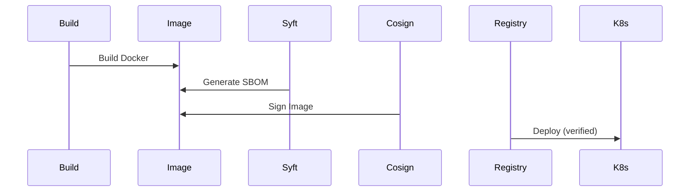

# Architecture: Supply-Chain Security Pipeline

## System Diagram
The following Mermaid.js sequence diagram maps the core workflow and interactions:

## The Supply-Chain Threat Model
Modern attacks target the software supply chain: compromised dependencies (SolarWinds), malicious packages (event-stream), and tampered build systems. This pipeline addresses each vector.

## Pipeline Stages

### 1. SBOM Generation (Syft)
A Software Bill of Materials is the "ingredient list" of your software. Syft scans container images and generates SBOMs in both SPDX and CycloneDX formats. This enables downstream tools and compliance auditors to know exactly what's inside.

### 2. Vulnerability Scanning (Grype + Trivy)
Defense-in-depth: two independent scanners cross-reference the SBOM and image against CVE databases. Different scanners have different coverage — using both minimizes blind spots.

### 3. Image Signing (cosign/Sigstore)
Keyless signing via Sigstore/Fulcio ensures cryptographic proof that the image was built by your CI/CD system. Unlike Docker Content Trust, cosign doesn't require managing long-lived signing keys — it uses ephemeral keys tied to your OIDC identity (GitHub Actions' OIDC token).

### 4. SLSA Provenance
SLSA (Supply-chain Levels for Software Artifacts) attestations record *who* built the artifact, *where*, *when*, and from *which source commit*. This is stored alongside the image in the registry.

### 5. Policy Enforcement
Two enforcement points:
- **OPA (CI Gate)**: Rego policies run in the pipeline and block deployment if critical CVEs exist or images are unsigned.
- **Kyverno (K8s Admission)**: Cluster-side policies reject pods that reference unsigned images, providing defense-in-depth even if CI is bypassed.
